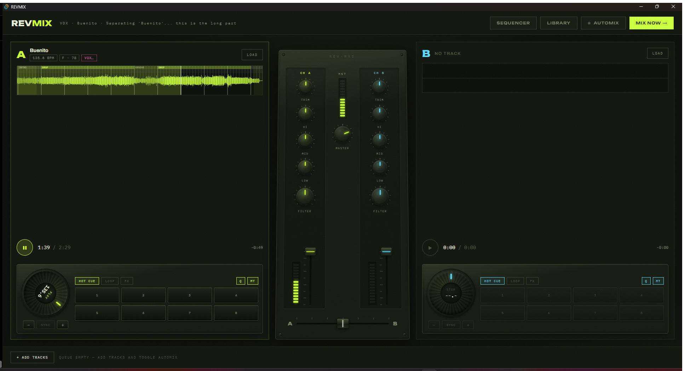

# REV·MIX

**A DJ rig that understands songs.** Twin CDJs, a skeuomorphic club mixer, and an AutoMix engine that reads BPM, key, energy, structure and vocals to plan phrase-aligned transitions — all on-device, in a Tauri desktop app.



## What it does

### Decks & console
- **Two CDJ units** — spinning jog wheels (drag to scrub), 8 **hot cues**, beat-snapped **auto-loops** (¼–32 beats, resize in place for halving builds), **SYNC** with smooth phase-pull (no playhead jumps), **pitch bend**, per-deck **quantize** and **master tempo** toggles
- **Performance FX pads** (HOLD or LOCK mode, stackable): TWIST, V.BRAKE, ECHO ½, ECHO ¼, REVERB, UNISON, TREM+, TIPTIP slip-roll
- **3D club mixer** — trim, 3-band EQ with full kill, sweep filter, channel faders, equal-power crossfader, LED VU meters. Every knob drives the same Web Audio graph the automation uses
- **Loop sequencer** — 16-step grid with six synthesized drum voices (no samples), deck-BPM sync, patterns saved to the library

### Keylock playback engine
Decks play through a custom **granular AudioWorklet** (`public/stretch-processor.js`): tempo changes are pitch-preserving (Hann-windowed overlap-add at unity pitch), with automatic fallback to vinyl-style resampling for brakes and ultra-low rates. Beatmatching never chipmunks the track.

### AutoMix
Every track is analyzed on-device — no cloud, no tagging service:

| Stage | How |
|---|---|
| BPM + beat grid | spectral-flux onset envelope → autocorrelation → phase fit, downbeats from bass-band flux |
| Key | chromagram → Krumhansl–Schmuckler profiles → Camelot code |
| Structure | phrase-aligned section classifier: INTRO · BUILD · DROP · BREAKDOWN · GROOVE · OUTRO, painted on the waveform |
| Vocals | optional stem separation (BS-Roformer) → per-second vocal activity curve |

A weighted scoring model (tempo affinity, harmonic compatibility, energy continuity, structural placement, **vocal-clash penalty**) picks the transition window, then chooses a style to fit the material:

- **ELEMENT BLEND** — 64-beat phased blend: one element of the incoming track fades in first (filtered percussion or melody), the incoming track's **drop lands exactly on the bass handover**, the outgoing track leaves through a tempo-synced echo tail
- **REVERB WASH** — for energy drops: the old track dissolves into reverb (dark IR for minor keys, bright for major) under a lowpass sweep
- **ECHO OUT** — when tempos are irreconcilable: clean phrase cut with a beat-synced delay tail, straight into the new track's drop

Both decks stay beat-locked for the entire overlap; the incoming deck glides to native tempo only after the old track is gone.

### Library
Tracks (auto-registered with BPM/key), freeform tags, playlists, and **set recording** — every transition that fires is logged with its style, length and model score. Save a set, requeue it later. Persists to a single JSON file. Less is more.

## Stack

- **Tauri 2** (Rust shell) · **React 19** + TypeScript · **Vite**
- **Web Audio** end to end — custom AudioWorklet playback, hand-rolled FFT/DSP for analysis, zero audio dependencies
- Optional Python sidecar for stem separation

## Running it

```sh
npm install
npm run tauri dev
```

Requires Node and the [Tauri 2 prerequisites](https://tauri.app/start/prerequisites/) (Rust toolchain + WebView2 on Windows).

> **Vocal awareness is optional.** It shells out to a sibling StemSep project (`../dj/python` — [audio-separator](https://github.com/nomadkaraoke/python-audio-separator) with a BS-Roformer model, run via `uv`). Without it, everything works — transitions are planned from energy/structure and vocals just show "analysing…".

## Quick start

1. **+ ADD TRACKS** — queue a few songs; they analyze in the background (BPM/key badges appear, sections paint onto the waveforms)
2. Hit **▶** on deck A
3. Toggle **AUTOMIX** — it plans, arms and executes transitions on its own, pulling the next track from the queue
4. Or do it yourself: SYNC, loops, FX pads, bass swap on the EQs — everything is live, and the automix never fights your hands on the mixer
